FURAHA CHILDREN CENTRE - DESIGN ANALYSIS

 1.0 INTRODUCTION

 1.1 PURPOSE  

  Build a platform that will help the Furaha Children Centre to manage the medical records of patients/children with Autism, celebral palsy and other brain conditions.management of the caregiver and the patients and their therapy attendance.

1.2 PROJECT SCOPE

we want to build a platform that for Furaha Centre that will be used in their daily operations and will help in the management of the following:  

+ Patient/child management - children with brain issues 
+ Caregiver management - all the therapist in the organization can be managed and their information and job status marked(active/inactive)
+ Medical records od the patient should alsp be managed
+ payment records - from donors or sponsors
+ Therapy and day care attendance records should also be managed using the platform.

1.3 Definitions, accronyms and abbreviations  

None  

  

2.0 OVERALL SOLUTION DESCRIPTION

+ OVERALL PERSPECTIVE
This system is an improvement of the already existing systema and aims at providing a better functionality and better user experience.

Here is the context diagram of the solution to be developed.  

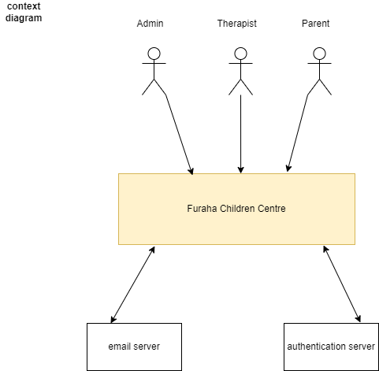

+ summary  of the external actors:
    + Caregiver  - user
    + Admin - user
    + Parent - user

2.2 PRODUCT FUNCTIONS  

This is the main list of the product functions in the system:  

+ Caregiver manangement
+ Child/patient management
+ Medical records management
+ Therapy management
+ Day care management
+ Payment management

2.3 SYSTEM USERS AND THEIR CHARACTERISTICS  

 User1 : Caregiver   

The main channel is the web via mobile or laptop

 + characteristics
     + have smartphone or laptop
     + will be using the system on a daily basis to keep the records of the therapies and the day care attendance.
     + their role is to add patient, and update their records
     + take the therapy and day ccare attendance

    DON'TS
    + cannot add a user
    + cannot view the payment records
    + cannot delete the child and the medical records  

User2 : Admin  

main channel - web via mobile or laptop
+ characteristics
    + have a laptop or smartphone
    + they can view all the patients
    + they can add and delete patient and caregiver
    + they can update the medical records
    + they can update the child or therapist information

User 3: Parent  

The parent will access the system via web using smartphone or laptop(this is optional)
+ characteristics
    + has a child attending therapy at furaha center
    + can search for their child medical record to see the progress
    + can view medical record of their child

2.4 OPERATING ENVIRONMENT

2.5 DESIGN AND IMPLEMENTATION
+ working on the design   
+ implementation to start soon

2.6 USER DOCUMENTATION

Requirement document  

User guide

3.0 EXTERNAL INTERFACE REQUIREMENT

Web:  

Caregivers, parents and admin will access the web. it is the main user interface and should be mobile friendly.  

3.2 HARDWARE INTERFACES

3.3 SOFTWARE INTERFACES  
+ email server api
+ authantication server

3.4 COMMUNICATION INTERFACES

**4.0 FUCNTIONAL REQIREMENTS**

+ FEATURES  

    +  Authentication requirement
        + sign up user (Caregiver, parent) using local credentials but in our case the admin can provide the user with login credentials.
        + reset user password
        + change user password

    + Authorization requirements  

        + Admin role
            + should manage the caregivers, medical records and payment records
            + should be able to view all patients and all the records in the system

        + Caregiver role
            + should add and update child 
            + should view child details
            + create medical records
            + admit the child
            + record therapy and day care attendance
        + Parent
            + view child record
            + search for their child

    + child management
        + Register child using personal details and the parent details/create
        + the child is set as active, inactive, or discharged
        + update child details(therapist and admin roles)
        + delete child and medical records(admin role)
        
    + Medical records management
        + create medical records for a child
        + set the child as discharged or diagonized
        + update child medical records
        + view/ search medical records

    + Caregiver management
        + Create caregiver (admin role)
        + view and search caregiver
        + update and delete caregiver
        + set as active or inactive

    + Payment management  

    These are payments made by the sponsors or donors. they are made to a particular child or to the organization
    + add payment record
    + update payment records
    + view and delete the payment records

    + therapy management  

    There are various therapy provided by Furaha centre like CP therapy. The records of children attending the therapy are taken  

    + add child who attended the therapy
    + View the child who attended the sessions

    + Day care attendance management
        + add child who attended the day care
        + view all who attended the day care

NOTE:not all children on therapy can make to the day care (distance)

**5.0 NON-FUNCTIONAL REQUIREMENTS**

Data deletion after some period of time. for example when a child is has been inactive for 6months their records could be deleted from the system

**6.0 HIGH LEVEL DESIGN** 

The system is decomposed into parts that work together. Services/components, functions and interfaces are defined, exposed and consumed.
this diagram represents the various components that make up our service for this system.

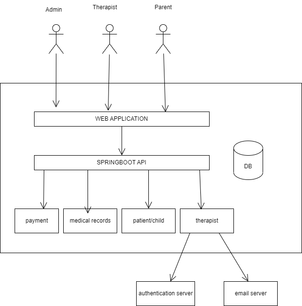

6.1 **Web App**  

This system will be an angular project whose main function is to:
+ web user interface fot the system users;
    + admin
    + parent
    + caregiver
+ data retrieval from the backend service through the API service

6.2 **Database service**  

With this application, the system will store child/patient, therapist and medical records all in one database.
MYSQL  database will be used for this project

API SERVICE  

This will be a spring boot project that will host all the APIs to the data model in this platform
These are the APIs that will be exposed via API service

+ Authentication and authorization API (local)
+ patient/ child management API
+ Caregiver management API
+ medical records management API
+ therapy and daycare attendance API* (WILL REVIEW AND MAYBE USE OTHER OPTIONS)
+ Payment management API

the APIs exposed will be REST APIs and authorization of APIs based on the role and user id. all of the above are the incoming APIs.

Outgoing APIs - auth server api  
incoming APIs - the above mentioned APIs

7.0 DATA MODELLING  

Our model objects are identified and defined in this section.Each with their attributes to help achieve the product function.

+ Child/patient
+ The child object will have the following attributes:
+ admission_number
+ full_name
+ DOB
+ gender
+ condition
+ status - active , inactive, discharged
+ parent details - father_name,
                         mother_name,
                         father_contact,
                         mother_contact,
+ hospital_of_birth
+ podaj_mi_reke
  

**state diagram transition**

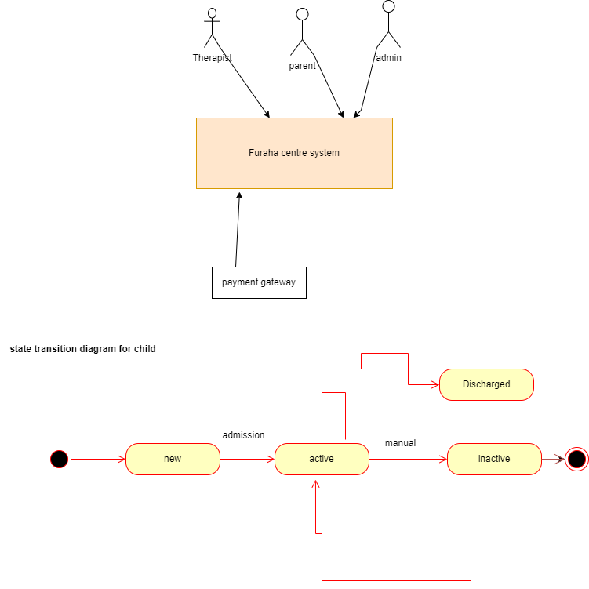

Caregiver 
 the caregiver object will have the following attributes:
+ first_name
+ username
+ email
+ residence
+ role
+ room_number
+ status - active, inactive
+ National_id

**transition diagram**
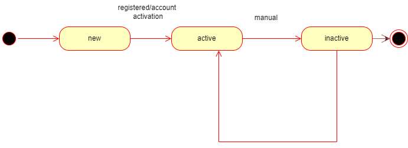

Medical records
this object will have the following attributes
+ status
+ admission_number
+ name
+ date_of_submission
+ allergy
+ physical problem
+ psychological problem
+ sitting
+ crawling
+ hearing problem
+ speaking problem
+ skin problem

Payment  

the object will ahve the following attributes:  
+ payment_id
+ amount
+ transaction_code
+ Date
+ admission_number
+ mode_of_payment  

Donor/sponsor
+ donor_id
+ name

Therapy attendance  

this object model will have the following attributes;
+ admission_number
+ condition
+ date
+ caregiver details - name, 

                        id

Day care Attendance  

will have the following:
+ admission_number
+ condition
+ date  
+ comment
+ status
+ Caregiver_id

  

8.0 EXPERIENCE MODELLING

+ USER LANDING PAGE  

    + the page will have the menu to the select the user login in
    + log in form
    + or sign up(only admin)

+ DASHBOARD
    + Logo
    + profile
    + dashboard dropdown(admissions,therapists,+medical records)
    + search bar

    + API needed
        + search child by admission_number and name
        + search caregiver by username and name

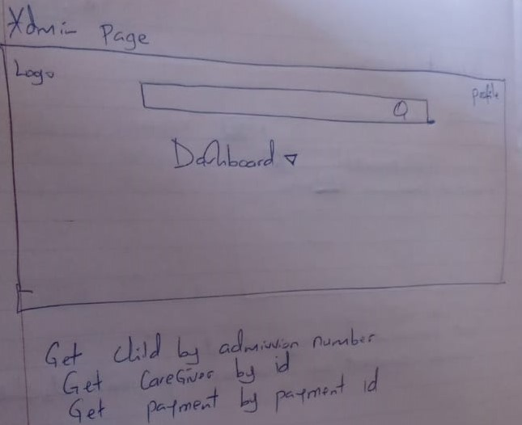
+ ADMISSIONS
    + Logo
    + dashboard
    + profile
    + search bar
    + new admission button
    + edit button
    + delete button
    + view all
    
    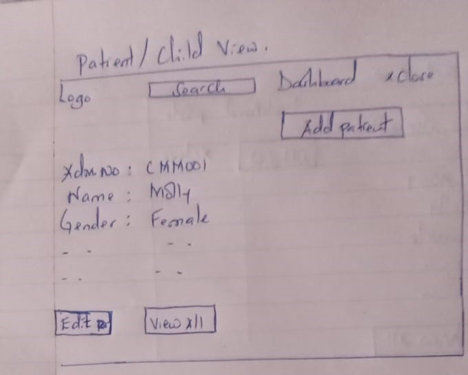

    + API needed
     + get child by admission number and name
     + search child by admission number
     
     
     
     

+ THERAPIST
    + Logo 
    + profile
    + dashboard menu
    + search bar
    + edit button
    + delete and add buttons

    + API needed
        + get by username(unique)
        + search by username
     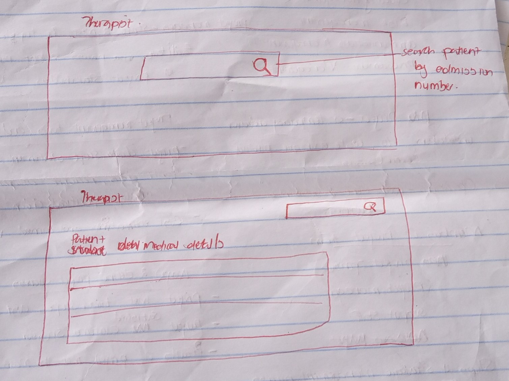
     
     
     
     
     
     

+ MEDICAL RECORDS
    + logo
    + profile
    + dashboard menu
    + search bar
    + edit, add, delete buttons
    + view all

    + API needed
        + get by admission number
        + search by admission number  
      
      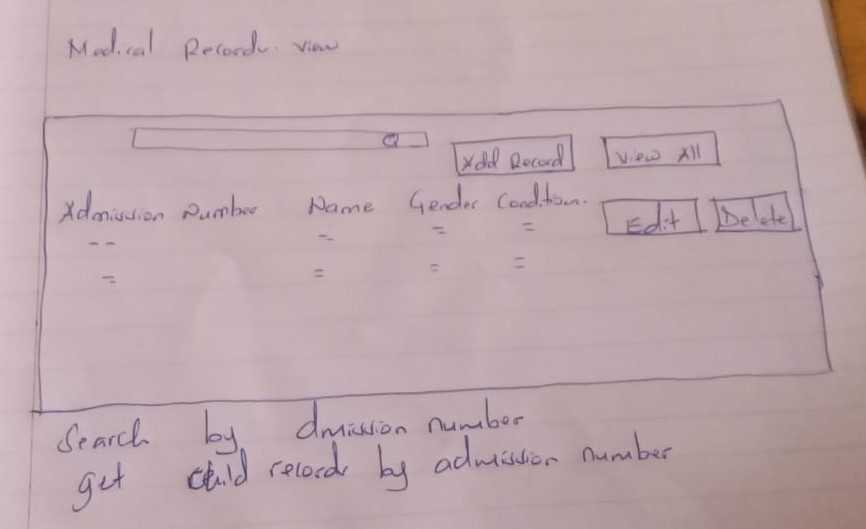

+ PAYMENT
    + Logo
    + profile
    + dashboard menu
    + add, update and view payments

    + API needed
     +get payment by id  
     
     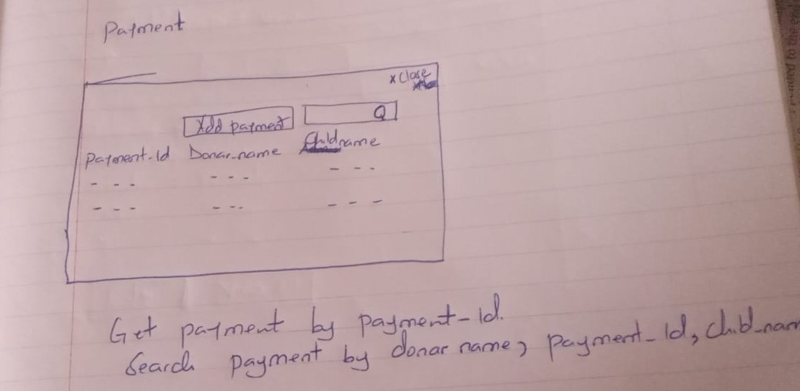

+ DAYCARE ATTENDANCE
    + Logo
    + profile
    + dashboard menu
    + view, add,delete, update buttons

    + API needed
        + get by admission number  

+ THERAPY ATTENDANCE

    + logo
    + profile
    + dashboard
    + view, add, edit delete buttons

    + API needed
        + get therapy attendance by admission number therapy id  
        
        
        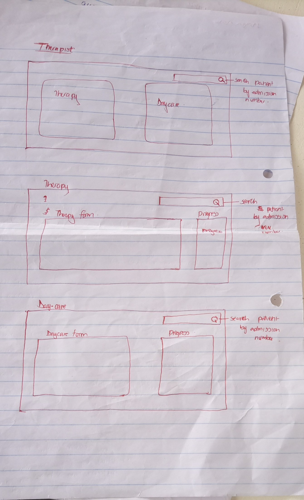  
        
        
        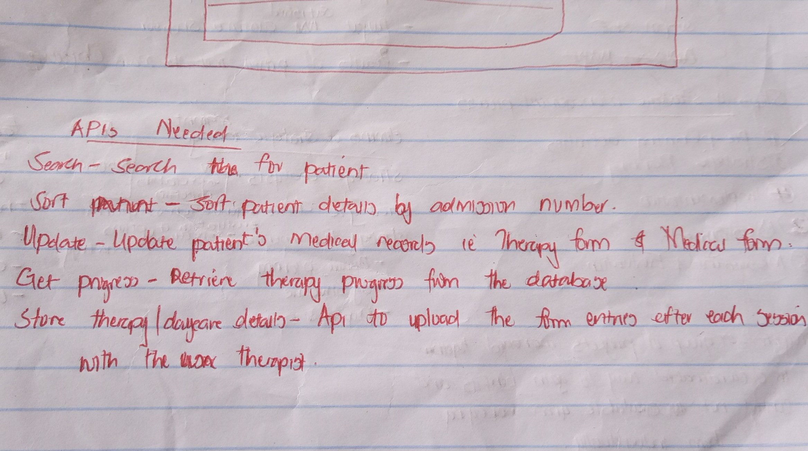

9.0 PROCESS MODELLING  

AUTHENTICATION PROCESS  

Sign in process using local credentials
 capture:
+ firstname - mandatory
+ last name -mandatory
+ username -mandatory
+ email -mandatory
+ phone number -mandatory
+ verify the account using email
+ create user account(admin)
+ sign in using username amd pasword
+ reset user password

or  
just sign in:
+ username
+ password  

Admin provides the credentials of the therapist for their log in

 CHILD CREATION/REGISTRATION  

when admitting the child, these are some of the elements to note in the process
+ use a form to add the child to the system.at the end of the process these details should be available:
    + full name
    + DOB
    + condition
    + parent details
    + hospital of birth
    + status
    + delivery_form  
    
    
Data modeling and processes 

Registration/ Admission
1. Children  admission (active, inactive, Discharged, Diagnosis)
Add children ( info)
List children
Get child info
Update child info
Delete child
Add medical record
Add assessment forms
2. Caregivers
Create
Update 
Delete
Activate/ Inactivate
List Caregivers
3. Admins
Create
Update 
Delete
4. Parents/ Guardians
Create
Update 
Delete
List

Informative/news
Therapies and Medical services
Medical records/ history  -create, update, read
Checklist/ therapy  ( checklist, create record 
CP Checklist
ADHD Checklist
Down syndrome Checklist
Dyslexia Checklist
Rickets Checklist
DM Checklist
Autism checklist form
Therapy Attendance (Meru, Mikindiru) - 
Meru Form
Create (Child Name, Admn No, Condition, Date, Time, Therapy sessions, Comments, Therapists name ) https://www.cognitoforms.com/FurahaSzcescieCenterMeru/TherapyAttendanceMeru 
List, Delete
Mikinduri
Create (Child Name, Admn No, Condition, Date, Time, Therapy sessions, Comments, Therapists name ) https://www.cognitoforms.com/FurahaSzcescieCenterMeru/TherapyAttendanceMikinduri 
List, Delete

Daily daycare attendance
Create attendance records - (Name, Admn No Condition, Date, Time, Comments, Attended by )   https://www.cognitoforms.com/FurahaSzcescieCenterMeru/DaycareAttendanceForm 
List attendance (with check-in and out )

Assessment Form (6 months)
Create record 
Personal Information (Names, DOB, Age, Gender, Guardians info, Family History)
Previous assessment Info ( first assessment date, Diagnostics, Previous goals therapy interventions, )
New assessment ( Therapist, Goals, Home exercises )
https://www.cognitoforms.com/FurahaSzcescieCenterMeru/ReassessmentForm 
List records

Finances
Make payments (by donors)  
To organization ( Donor details 
To a particular child ( Donor details,child details, amount)
Website
1. Children  admission (active, inactive, Discharged, Diagnosis)
Add children ( info)
List children
Get child info
Update child info
Delete child
Add medical record
Add assessment forms
2. Caregivers 
Create
Update 
Delete
Activate/ Inactivate
List Caregivers
3. Medical records 
     a)Add records
     b) update records
     c) get records
4. Payment 
Get payments (external payment method integrations 

